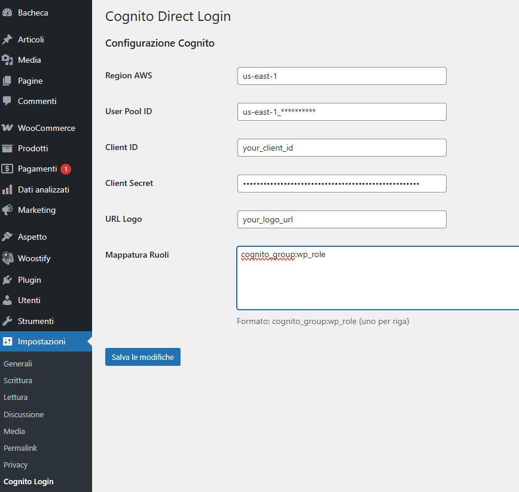

# AWS Cognito Direct Login for WordPress

A WordPress plugin that provides direct authentication with AWS Cognito without using the Hosted UI, featuring a modern, customizable login interface.



## Features

- **Direct Cognito Authentication**: Login directly with AWS Cognito using email and password (no Hosted UI redirect)
- **Modern UI**: Clean, responsive login interface with dark theme
- **Role Mapping**: Automatically map Cognito user groups to WordPress roles
- **Seamless Integration**: Replaces default WordPress login with custom Cognito-powered authentication
- **WooCommerce Compatible**: Redirects "My Account" page to custom login for non-authenticated users
- **Secure**: Uses AWS Cognito's USER_PASSWORD_AUTH flow with SECRET_HASH validation

## Requirements

- WordPress 5.0 or higher
- PHP 7.4 or higher
- AWS Cognito User Pool with:
  - App Client configured with `USER_PASSWORD_AUTH` flow enabled
  - App Client Secret enabled

## Installation

1. Download or clone this repository
2. Upload the `wp-cognito-direct-login` folder to your `/wp-content/plugins/` directory
3. Activate the plugin through the WordPress admin panel
4. Configure your AWS Cognito settings (see Configuration section)

## Configuration

Go to **Settings > Cognito Login** in your WordPress admin panel and configure:

### Required Settings

- **AWS Region**: Your Cognito User Pool region (e.g., `us-east-1`)
- **User Pool ID**: Your Cognito User Pool ID
- **Client ID**: Your App Client ID
- **Client Secret**: Your App Client Secret

### Optional Settings

- **Logo URL**: URL to your custom logo (displayed on login page)
- **Role Mapping**: Map Cognito groups to WordPress roles

### Role Mapping Format

```
cognito_group_name:wordpress_role
```

Example:
```
admins:administrator
editors:editor
customers:customer
```

Default role for users without mapped groups: `subscriber`

## How It Works

1. User enters email and password on custom login page
2. Plugin authenticates with AWS Cognito using `InitiateAuth` API
3. On successful authentication, receives ID token and user attributes
4. Creates or updates WordPress user based on Cognito user data
5. Maps Cognito groups to WordPress roles
6. Logs user into WordPress and redirects based on role

## Login Flow

- **Administrators/Editors**: Redirected to `/wp-admin/`
- **Other users**: Redirected to site homepage
- **Logout**: Redirects to homepage instead of login page

## Screenshots

### Login Interface


### Admin Settings


## Customization

The login interface can be customized by modifying the CSS in the `enqueue_login_assets()` method. The design uses:

- Dark theme with modern glassmorphism effects
- Responsive layout (desktop/mobile optimized)
- Custom branded left panel with logo
- SVG icons for inputs and buttons

## Security Notes

- Uses nonce verification for AJAX requests
- Validates AWS Cognito responses
- Generates secure random passwords for WordPress users
- Stores Cognito metadata (sub, groups) in user meta

## Troubleshooting

### Authentication Fails

- Verify AWS credentials are correct
- Ensure `USER_PASSWORD_AUTH` flow is enabled in Cognito App Client settings
- Check that Client Secret is configured

### Users Not Getting Correct Roles

- Verify role mapping syntax in settings
- Check that Cognito groups are correctly assigned to users in AWS Console

## Author

Created by [@bigtower17](https://github.com/bigtower17)

## License

This plugin is open source. Feel free to modify and distribute as needed.

## Support

For issues, questions, or contributions, please visit the [GitHub repository](https://github.com/bigtower17/wp-cognito).
